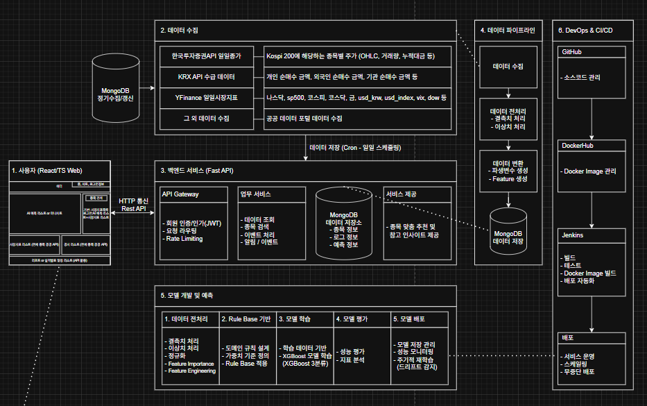

# RichClub
주식 자산 AI 관리 플랫폼으로, 본 서비스는 개발 포트폴리오 및 기술 시연을 위한 데모입니다. 제공되는 AI 분석, 예측, 점수 및 시뮬레이션 결과는 연구·학습 목적의 예시이며 투자자문 또는 금융투자상품에 대한 권유가 아닙니다. 본 서비스는 투자자문업 또는 유사투자자문업을 영위하지 않으며, 제공되는 정보를 실제 투자 의사결정의 근거로 사용해서는 안 됩니다. 투자에 따른 모든 책임은 투자자 본인에게 있습니다. 과거의 성과나 AI 예측 결과는 미래의 수익이나 성과를 보장하지 않습니다. 본 서비스를 불법적인 행위, 관련 법령을 위반하는 행위 또는 제3자의 권리를 침해하는 목적으로 사용해서는 안 되며, 이러한 사용으로 발생하는 모든 책임은 사용자에게 있습니다.


## 구조

```
RichClub/
  web_server/      # FastAPI 백엔드
  web_client/      # React + TypeScript 프론트엔드
  collect_data/    # 데이터 수집 스크립트 (seongsu, jungho 등 팀원별)
  docker-compose.yml
```

## 시스템 구성도


---

## 인증 규칙

### 암호화
- 비밀번호: `bcrypt` 해싱 (단방향, 복호화 불가)
- 토큰: `HS256` 알고리즘 JWT

### JWT 토큰 구조
| 토큰 | 유효기간 | 용도 |
|---|---|---|
| access_token | 60분 | API 요청 인증 |
| refresh_token | 14일 | access_token 재발급 |

### API 인증 방식
Bearer 토큰 또는 HttpOnly 쿠키 둘 다 지원

```
Authorization: Bearer <access_token>
```

또는 로그인 시 자동으로 설정되는 쿠키 사용 (프론트에서 `credentials: 'include'` 또는 axios `withCredentials: true` 필요)

### 엔드포인트
| 메서드 | 경로 | 설명 |
|---|---|---|
| POST | /api/v1/auth/signup | 회원가입 (이메일 인증 필수) |
| POST | /api/v1/auth/login | 로그인 |
| POST | /api/v1/auth/refresh | 토큰 재발급 |
| POST | /api/v1/auth/logout | 로그아웃 (쿠키 삭제) |
| GET | /api/v1/auth/me | 내 정보 조회 |
| POST | /api/v1/auth/email/send-code | 이메일 인증코드 발송 (5분 만료) |
| POST | /api/v1/auth/email/verify-code | 이메일 인증코드 검증 |
| POST | /api/v1/auth/password/reset | 비밀번호 재설정 (이메일 인증 후) |

### 이메일 인증
- 회원가입 시 이메일 인증 필수
- Gmail SMTP로 6자리 코드 발송, 5분 만료
- 비밀번호 찾기: 이메일 인증 후 새 비밀번호 설정 가능 (로그인 폼 하단 링크로 접근)
- MongoDB `email_verifications` 컬렉션에 TTL 인덱스로 자동 만료

### MongoDB users 컬렉션 구조
```json
{
  "_id": "ObjectId",
  "email": "string (unique index)",
  "hashed_password": "string (bcrypt)",
  "name": "string",
  "is_active": "boolean",
  "created_at": "datetime (UTC)",
  "updated_at": "datetime (UTC)"
}
```

---

## MongoDB 컬렉션

| 컬렉션 | 설명 |
|---|---|
| users | 회원 정보 |
| total_trading_signals | 종목별 일별 예측 신호 + 수익률 (ret_1d, ret_5d, ret_20d, ret_60d) + ma5/ma20/ma60/high/low/close + pred_score/reg_score 포함 |
| model_train_history | 모델 학습 이력 |
| model_performance_monthly | 월별 신호 성능 집계 (매수/매도/관망 승률, 평균 수익률) |
| watchlist | 관심종목 |
| trade_logs | 매매일지 (소프트딜리트 지원) |
| email_verifications | 이메일 인증 코드 (TTL 5분 자동 만료) |

---

## AI 모델

### 모델 목록
| 모델 ID | 설명 |
|---|---|
| ju-model-v2 | XGBoost + LightGBM 앙상블, KOSPI 50종목 대상, yfinance 실시간 수집 |
| seo-model-v1 | LightGBM + XGBoost 분류/회귀, seojin CSV 기반, KOSPI/KOSDAQ 전종목 |
| seo-model-v2 | seo-model-v1 개선판, lgb_regressor 기반 시뮬레이션 (원본 6000% 결과 재현) |

### seo-model 예측 신호
| 필드 | 설명 |
|---|---|
| pred_score | lgb_classifier + xgb_classifier 소프트 보팅 확률 (레이블 1 확률) |
| reg_score | lgb_regressor 단독 예측값 (시뮬레이션 매수 기준: > 0.05) |
| above_max_volume_profile | 볼륨 프로파일 상단 여부 (1=조건 충족) |
| target | 레이블 (3=침체, 제외 대상) |

### 추천 종목 조건 (KOSPI200 + KOSDAQ150 대상)
- classifier: pred_score > 0.70 + target != 3 + above_max_volume_profile == 1
- regressor: reg_score > 0.05 + target != 3 + above_max_volume_profile == 1

---

## MLOps 파이프라인

서버 내부에서 자체적으로 학습, 예측, 평가까지 수행합니다.

### 흐름

```
서버 최초 실행
    |
XGBoost/LightGBM 모델 자동 학습
    |
매일 KST 15:35 (UTC 06:35)
    |
ju-model-v2 전 종목 예측 -> total_trading_signals upsert -> 텔레그램 알림
    |
매일 KST 15:40 (UTC 06:40)
    |
seo-model-v1 예측 (KOSPI/KOSDAQ 전종목) -> 텔레그램 알림
    |
매일 KST 15:45 (UTC 06:45)
    |
seo-model-v2 예측 (KOSPI/KOSDAQ 전종목) -> 텔레그램 알림
    |
매일 UTC 07:00
    |
수익률 계산 + 월별 집계 -> model_performance_monthly 저장
    |
매주 수요일 성능 체크
    |
매수 신호 2개월 정확도 50% 미만이면 자동 재학습
    |
매주 일요일 정기 재학습
```

### 스케줄러 (UTC 기준)
| 스케줄 | 작업 |
|---|---|
| 월~금 06:35 | ju-model-v2 예측 + 텔레그램 알림 |
| 월~금 06:40 | seo-model-v1 예측 + 텔레그램 알림 |
| 월~금 06:45 | seo-model-v2 예측 + 텔레그램 알림 |
| 매일 07:00 | 수익률 계산 + 월별 집계 |
| 매주 수요일 09:00 | 성능 체크 후 필요시 자동 재학습 |
| 매주 일요일 23:00 | 정기 모델 재학습 |

---

## 텔레그램 봇

봇: `@richclub_ai_signal_bot` (https://t.me/richclub_ai_signal_bot)

### 명령어
| 명령어 | 권한 | 설명 |
|---|---|---|
| /start | 누구나 | 봇 소개 및 명령어 안내 |
| /subscribe | 누구나 | 매수/매도 신호 알림 구독 |
| /unsubscribe | 누구나 | 구독 해제 |
| /status | 누구나 | 서버 상태 및 최근 24h 예측 현황 |
| /predict | 관리자 | 전체 모델 즉시 예측 실행 |
| /retrain | 관리자 | ju-model-v2 즉시 재학습 |

### 환경변수 설정 (/var/jenkins_home/.env)
```
TELEGRAM_BOT_TOKEN=봇토큰
TELEGRAM_CHAT_ID=기본채널chat_id
TELEGRAM_ADMIN_IDS=관리자chat_id (쉼표 구분 복수 가능)
TELEGRAM_WEBHOOK_URL=https://richclub.efforthye.dev
```

### Webhook 엔드포인트
```
POST /telegram/webhook
```
서버 시작 시 `TELEGRAM_WEBHOOK_URL/telegram/webhook`으로 자동 등록됩니다.

### 수동 알림 전송 (테스트용)

```bash
docker exec richclub-api python3 -c "
import asyncio
from app.utils.telegram import notify_signals

async def main():
    signals = [
        {'stock_code': '005930', 'stock_name': '삼성전자', 'signal': '매수', 'close': 334000},
        {'stock_code': '000270', 'stock_name': '기아', 'signal': '매도', 'close': 138000},
    ]
    await notify_signals('seo-model-v2', signals)

asyncio.run(main())
"
```

---

## MLOps 대시보드

관리자용 대시보드: `/mlops` (로그인 필요)

- 모델 현황 (모델 존재 여부, 마지막 정확도, 수익률 계산 진행 상황)
- 기간별 신호 성능 (30/60/90/180일, 매수/매도/관망 승률 및 평균 수익률)
- 월별 성능 테이블 (월별 승률 + 5일 평균 수익률)
- 학습 이력
- 최근 신호 목록 (1일/5일/20일 수익률 포함)

---

## 프론트엔드 주요 기능

### 메인 화면 (/)
로그인하지 않으면 `/auth`로 리다이렉트. 로그인 후 메인 대시보드 진입.

모바일/데스크탑 반응형:
- 모바일(768px 이하): 하단 탭바로 차트/AI예측/글로벌/승률 전환
- 데스크탑: 좌측 패널(글로벌시장+승률테스트), 중앙 차트, 우측 패널(AI예측/추천/지표예측/관심종목/뉴스)

### 차트 (StockSearchSection)
- 일봉 캔들 + 이동평균선(MA5/MA20/MA60) + 일목균형표(구름대/전환선/기준선)
- MACD, RSI 보조지표 하단 표시
- 드래그 패닝, 스크롤 줌, Shift+스크롤 좌우 이동
- AI 매수/매도 신호 캔들 위 레이블 표시
- 종합신호 박스: 침체구간/MA60턴/골든보/강한매수/매수우세/음봉주의/중립/매도우세/강한매도
- 변곡선: 시작점(S)/끝점(E) 클릭으로 주기 설정, 과거/미래 추세선 표시
- 골든보 감지: MA60 우상향 + U자 지지 후 반등 + MACD 시그널 위 -> 보라색 뱃지
- 음봉 매수 금지: 강한매수여도 음봉이면 "음봉 주의" 표시
- 침체 구간 판단 (캔들 투명도 처리):
  - 일목균형표 침체: 선행스팬 역배열(spanA < spanB) + 캔들이 spanA 아래 (15% 투명)
  - MA60 하락: 25% 투명

### 우측 패널 탭
| 탭 | 설명 |
|---|---|
| AI 예측 | AI 신호 기반 종목 목록, 매수/매도/관망 필터, 관심종목 토글 |
| 추천종목 | KOSPI200+KOSDAQ150 대상, seo-model-v2 기준 추천 종목 (REG/CLF 뱃지로 모델 구분) |
| 지표 예측 | MA/RSI/MACD 기반 종합 신호 목록, 오늘/3일/7일 필터 |
| 관심종목 | 즐겨찾기 종목 목록, AI 신호 + 현재가, 클릭 시 차트 이동 |
| 뉴스 | 네이버 뉴스 API, 종목명 또는 키워드 검색 |

### AI 실적 페이지 (/performance)
- 모델별(ju-model-v2/seo-model-v1/seo-model-v2) AI 실적 조회
- AI 실적 탭: 개별 거래 신호 기반 합산 수익률
- 시뮬레이션 탭: 원금 입력 후 복리 시뮬레이션 (동시 보유 종목 수 직접 입력 가능)
  - seo-model 계열: lgb_regressor 기반 원본 시뮬레이션 로직 (reg_score > 0.05 매수, 5일선 이탈 매도)
  - 연도별 상세보기: 실제 체결 거래 내역 조회
- 기간: 1m/3m/6m/all + 연도별 필터

### 관심종목
- 우측 패널 AI/지표 탭에서 별표 클릭으로 추가/제거

### 매매일지
- 차트 화면에서 "매매일지" 버튼으로 모달 오픈
- 매수/매도 기록, 종목/가격/수량/메모 입력
- 현재 종목 선택 시 현재가 자동 조회
- 수량 입력 시 가격 자동 채우기
- 인라인 수정, 소프트딜리트(휴지통), 복구, 영구삭제
- CSV 내보내기 (BOM 포함 UTF-8)

### 승률 테스트 (WinRateSection)
4개 탭으로 전략별 백테스트:
- AI: AI 신호 기반 매수/매도 (MA60 하락 + 일목 침체 구간 매수 제외)
- 5일선: AI 매수 + 5일선 꺾임 매도 (침체 구간 매수 제외)
- AI+지표: AI + MA 정배열 동시 매수 / AI or MA 역배열 매도 (침체 구간 제외)
- 지표: MA 정배열 첫 진입 매수 / MA 역배열 매도 (침체 구간 제외)

기간: 1m/3m/6m/all + 직접 날짜 입력(YYMMDD)
만약 이대로 투자했다면 시뮬레이터 (투자금 입력시 최종금액 계산)

### 글로벌 시장 (GlobalMarketSection)
나스닥, S&P500, 필라델피아 반도체, 나스닥100 ETF, 달러/원, WTI 원유, 금, VIX
Yahoo Finance 캐시 10분 / 투자환경 종합신호(매수우호/중립/비우호)

### 인증 (AuthContainer)
- 로그인/회원가입 탭 전환
- 회원가입: 이메일 인증 후 가입 (인증코드 입력, 5분 타이머)
- 비밀번호 찾기: 로그인 폼 하단 링크 -> 이메일 인증 -> 새 비밀번호 설정

---

## API 엔드포인트

### market
| 메서드 | 경로 | 설명 |
|---|---|---|
| GET | /api/v1/market/global | 글로벌 시장 현황 (10분 캐시) |
| GET | /api/v1/market/winrate | AI 승률 테스트 |
| GET | /api/v1/market/winrate/simple | AI 매수 + 5일선 매도 승률 |
| GET | /api/v1/market/winrate/combined | AI + 정배열 동시 매수 승률 |
| GET | /api/v1/market/winrate/indicator | 지표만 승률 (AI 무시) |
| GET | /api/v1/market/performance/{model_id} | AI 모델 실적 (기간/연도 필터) |
| GET | /api/v1/market/simulation/{model_id} | 포트폴리오 시뮬레이션 (원금/종목수/연도) |
| GET | /api/v1/market/simulation-detail/{model_id} | 시뮬레이션 실제 체결 거래 내역 |
| GET | /api/v1/market/recommend | KOSPI200+KOSDAQ150 추천 종목 (seo-model-v2 기준) |

### stock
| 메서드 | 경로 | 설명 |
|---|---|---|
| GET | /api/v1/stock/today-signals | 오늘 종합 신호 목록 |
| GET | /api/v1/stock/price/{stock_code} | 종목 현재가 조회 |
| GET | /api/v1/stock/chart/candle/{code} | 일봉 캔들 데이터 |
| GET | /api/v1/stock/chart/macd/{code} | MACD 데이터 |
| GET | /api/v1/stock/chart/rsi/{code} | RSI 데이터 |
| GET | /api/v1/stock/ai/predictions | AI 예측 신호 목록 |

### telegram
| 메서드 | 경로 | 설명 |
|---|---|---|
| POST | /telegram/webhook | 텔레그램 webhook 수신 엔드포인트 |

### news
| 메서드 | 경로 | 설명 |
|---|---|---|
| GET | /api/v1/news | 네이버 뉴스 검색 |

---

## 로컬 실행

### 백엔드 (web_server)

> Windows 환경에서는 python 대신 py 사용, pip 대신 python -m pip 사용

```powershell
cd web_server

# 1. 가상환경 생성 (Python 3.11 필요)
py -3.11 -m venv .venv --copies

# 2. 가상환경 활성화 - (.venv) 표시 확인
.venv\Scripts\Activate.ps1

# 실행 정책 오류 시 먼저 실행 후 다시 활성화
Set-ExecutionPolicy -ExecutionPolicy RemoteSigned -Scope CurrentUser

# 3. 패키지 설치
python -m pip install -r requirements.txt

# 4. 서버 실행
python -m uvicorn app.main:app --reload
```

Swagger: http://localhost:8000/docs

### 환경변수 설정

`web_server/.env` 파일 작성:

```
MONGODB_URI=mongodb+srv://<username>:<password>@<cluster>.mongodb.net
MONGODB_DB=richclub
JWT_SECRET_KEY=your-secret-key-here
JWT_ALGORITHM=HS256
JWT_ACCESS_TOKEN_EXPIRE_MINUTES=60
SMTP_HOST=smtp.gmail.com
SMTP_PORT=587
SMTP_USER=your_gmail@gmail.com
SMTP_PASSWORD=your_app_password_16digits
EMAIL_FROM=your_gmail@gmail.com
NAVER_CLIENT_ID=your_naver_client_id
NAVER_CLIENT_SECRET=your_naver_client_secret
TELEGRAM_BOT_TOKEN=텔레그램_봇_토큰
TELEGRAM_CHAT_ID=기본채널_chat_id
TELEGRAM_ADMIN_IDS=관리자_chat_id (쉼표 구분)
TELEGRAM_WEBHOOK_URL=https://your-server-domain.com
```

### 프론트엔드 (web_client)

```powershell
cd web_client
npm install
npm start
```

---

## Docker로 전체 실행

```powershell
docker compose up -d
```

---

## 배포 환경

### 인프라 구성
- 서버: Mac M1 Mini (홈 서버, 192.168.219.100)
- 외부 접근: Cloudflare Tunnel (터널명: richclub, ID: e6282c0b-ada1-49d2-8e3e-e7c7e78882ac)
- 컨테이너: Docker + Colima (Mac ARM64, 메모리 6GB / CPU 4코어)
- CI/CD: Jenkins (push 감지 -> 자동 빌드/배포)

### 서비스 주소
| 서비스 | 주소 |
|---|---|
| API 서버 | https://richclub.efforthye.dev |
| API 문서 | https://richclub.efforthye.dev/docs |
| 프론트엔드1 | https://richclub-client.efforthye.dev |
| 프론트엔드2 | https://rich-club-front-end.vercel.app |
| Jenkins | https://jenkins.efforthye.dev |
| Jenkins 포트 | 9090 (내부) |
| 텔레그램 봇 | https://t.me/richclub_ai_signal_bot |

### Docker 이미지
- 백엔드: `efforthye/richclub-api:latest` (포트 8000)
- 프론트: `efforthye/richclub-front:latest` (포트 3000, nginx 서빙)
- 모델 볼륨: `-v /Users/nadeko/models:/app/models`
- 데이터 볼륨: `-v /Users/nadeko/collect_data:/app/collect_data`

### Cloudflare Tunnel 설정 (/etc/cloudflared/config.yml)
```yaml
tunnel: e6282c0b-ada1-49d2-8e3e-e7c7e78882ac
credentials-file: /Users/nadeko/.cloudflared/e6282c0b-ada1-49d2-8e3e-e7c7e78882ac.json
ingress:
  - hostname: richclub.efforthye.dev
    service: http://localhost:8000
  - hostname: richclub-client.efforthye.dev
    service: http://localhost:3000
  - hostname: jenkins.efforthye.dev
    service: http://localhost:9090
  - service: http_status:404
```

서비스 재시작:
```bash
sudo launchctl stop com.cloudflare.cloudflared
sudo launchctl start com.cloudflare.cloudflared
sudo cp ~/.cloudflared/config.yml /etc/cloudflared/config.yml
```

### Mac M1 미니에서 수동 백엔드 배포

```bash
docker pull efforthye/richclub-api:latest
docker stop richclub-api && docker rm richclub-api
docker run -d \
  --name richclub-api \
  --restart unless-stopped \
  -p 8000:8000 \
  --env-file /var/jenkins_home/.env \
  -v /Users/nadeko/models:/app/models \
  -v /Users/nadeko/collect_data:/app/collect_data \
  efforthye/richclub-api:latest
```

### Mac M1 미니에서 수동 프론트 배포

```bash
cd /Users/nadeko/Desktop/programs/study/RichClub
git pull origin dev
cd web_client
docker build -t efforthye/richclub-front:latest .
docker stop richclub-front && docker rm richclub-front
docker run -d --name richclub-front --restart unless-stopped -p 3000:80 efforthye/richclub-front:latest
```

---

## CI/CD

Jenkins + GitHub hook trigger 방식으로 자동 배포.
efforthye 브랜치에 push 시 백엔드(richclub)/프론트(richclub-front) 잡 모두 자동 빌드.

### 흐름

```
코드 수정
    |
git push (efforthye 브랜치)
    |
Jenkins GitHub hook trigger
    |
Docker 빌드 (GENERATE_SOURCEMAP=false, REACT_APP_API_BASE_URL=https://richclub.efforthye.dev)
    |
DockerHub push
    |
기존 컨테이너 교체 배포
    |
헬스체크 후 완료
```

### Jenkins 잡 목록
| 잡 이름 | Jenkinsfile 경로 | 설명 |
|---|---|---|
| richclub | web_server/Jenkinsfile | 백엔드 자동 배포 |
| richclub-front | web_client/Jenkinsfile | 프론트 자동 배포 |

### Jenkins 설정
- Docker 소켓: `/Users/nadeko/.colima/docker.sock` -> `/var/run/docker.sock` 심볼릭 링크
- Jenkins 볼륨: `jenkins_home` (Docker 볼륨)
- 환경변수 파일: `/var/jenkins_home/.env`
- Docker CLI: Jenkins 컨테이너 내부에 `docker.io` 설치

### Jenkins Credentials 설정
| ID | Kind | 설명 |
|---|---|---|
| github-token | Secret text | GitHub Personal Access Token |
| dockerhub-credentials | Username with password | DockerHub 계정 및 토큰 |

### Colima 설정
```bash
# 메모리/CPU 변경 시
colima stop
colima start --memory 6 --cpu 4

# Docker 소켓 심볼릭 링크 (Colima 재시작 후 필요)
sudo ln -sf /Users/nadeko/.colima/docker.sock /var/run/docker.sock
docker exec -u root jenkins chmod 666 /var/run/docker.sock
```

### Cloudflare Tunnel 서비스 등록 (Mac M1 미니)

```bash
sudo cloudflared service install
sudo launchctl list | grep cloudflared
sudo cat /Library/Logs/com.cloudflare.cloudflared.err.log | tail -20
```

---

## CORS 허용 목록 (main.py)

```python
ALLOWED_ORIGINS = [
    "http://localhost:3000",
    "http://localhost:5173",
    "https://rich-club-front-end.vercel.app",
    "https://richclub-client.efforthye.dev",
    "https://richclub.mayo.im",
]
```

새 도메인 추가 시 `web_server/app/main.py`의 `ALLOWED_ORIGINS` 수정 후 push.

# 참고 사항
> 본 서비스는 개발 포트폴리오 및 기술 시연을 위한 데모입니다. 제공되는 AI 분석, 예측, 점수 및 시뮬레이션 결과는 연구·학습 목적의 예시이며 투자자문 또는 금융투자상품에 대한 권유가 아닙니다. 본 서비스는 투자자문업 또는 유사투자자문업을 영위하지 않으며, 제공되는 정보를 실제 투자 의사결정의 근거로 사용해서는 안 됩니다. 투자에 따른 모든 책임은 투자자 본인에게 있습니다. 과거의 성과나 AI 예측 결과는 미래의 수익이나 성과를 보장하지 않습니다. 본 서비스를 불법적인 행위, 관련 법령을 위반하는 행위 또는 제3자의 권리를 침해하는 목적으로 사용해서는 안 되며, 이러한 사용으로 발생하는 모든 책임은 사용자에게 있습니다.

> This service is a demo for portfolio and technical demonstration purposes only. All AI analysis, predictions, scores, and simulation results are provided as examples for research and educational purposes and do not constitute investment advice or solicitation of any financial investment product. This service does not operate as an investment advisory or similar advisory business. The information provided must not be used as the basis for actual investment decisions. All investment decisions and their outcomes are the sole responsibility of the investor. Past performance and AI prediction results do not guarantee future returns or performance. Furthermore, this service must not be used for illegal activities, violations of applicable laws, or infringement of third-party rights, and the user bears full responsibility for any such use.